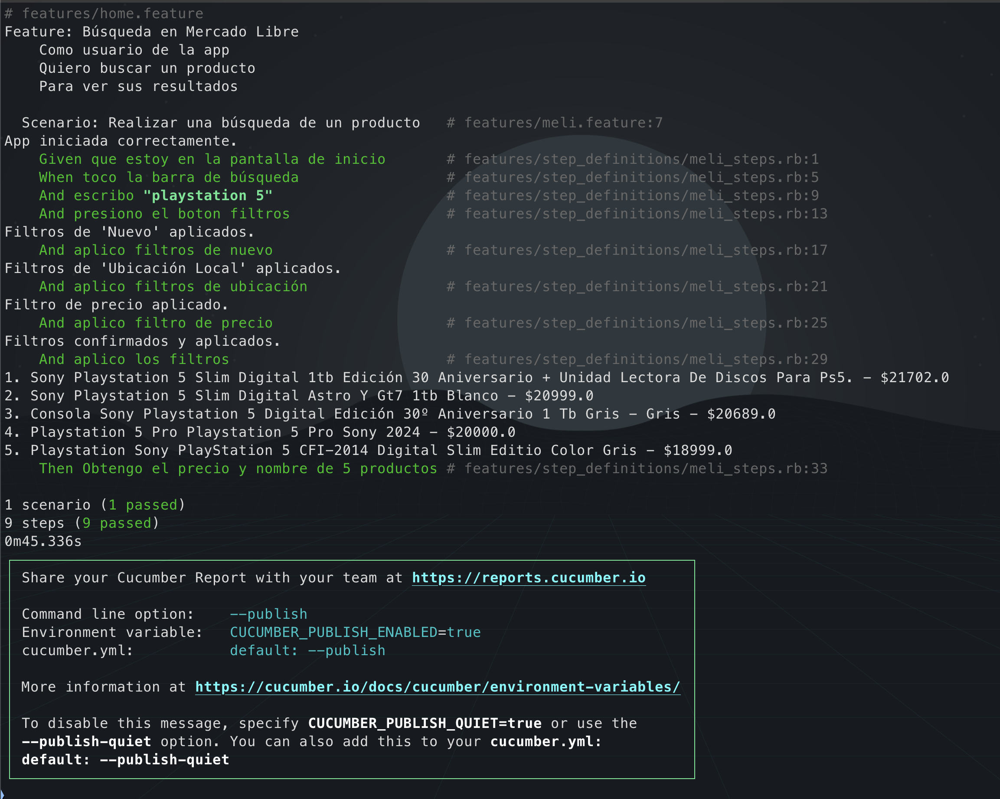
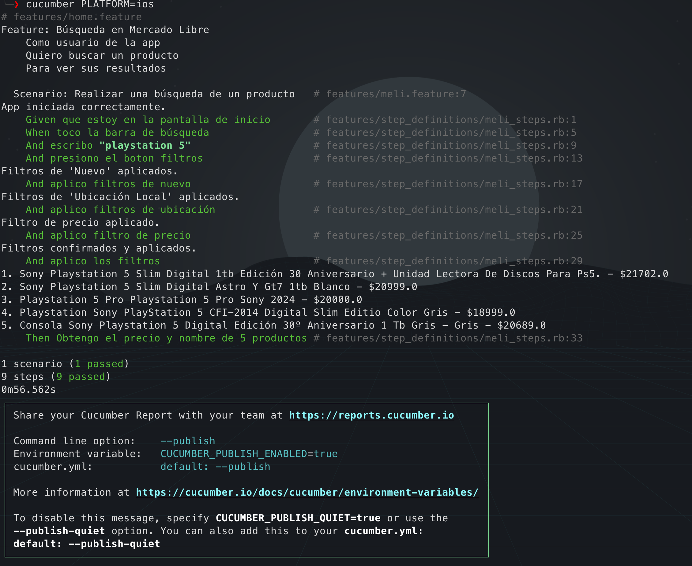

# 📱 Proyecto de Automatización Móvil - Mercado Libre (Android & iOS)

Este repositorio contiene un framework de automatización de pruebas End-to-End (E2E) para la aplicación nativa de **Mercado Libre**.

Desarrollé este proyecto utilizando **Ruby**, **Cucumber** y **Appium**, implementando el patrón de diseño **Page Object Model (POM)** para garantizar un código escalable, mantenible y capaz de ejecutarse tanto en dispositivos **Android** como en **iOS**.

---

## 🛠️ Stack Tecnológico

* **Lenguaje:** Ruby 3.x
* **Framework de BDD:** Cucumber (Gherkin)
* **Motor de Automatización:** Appium 2.0
* **Drivers:**
    * 🤖 Android: `UiAutomator2`
    * 🍎 iOS: `XCUITest`
* **Gestión de Dependencias:** Bundler

---

## 📋 Prerrequisitos

Antes de ejecutar el proyecto, asegúrate de tener el entorno configurado:

### General
1.  **Ruby & Bundler:**
    ```bash
    gem install bundler
    ```
2.  **Appium Server:**
    ```bash
    npm install -g appium
    ```
3.  **Drivers de Appium:**
    ```bash
    appium driver install uiautomator2
    appium driver install xcuitest
    ```

### Variables de Entorno (Android)
Asegúrate de tener `ANDROID_HOME` configurado en tu `.zshrc` o `.bash_profile`:
```bash
export ANDROID_HOME="/Users/[tu_usuario]/Library/Android/sdk"
```

---

## 🚀 Instalación y Configuración

1.  **Clona el repositorio:**

    ```bash
    git clone <URL_DEL_REPO>
    cd Android-CV
    ```

2.  **Instala las gemas:**

    ```bash
    bundle install
    ```

3.  **Configura tu dispositivo:**
    
    Edita el archivo `features/support/env.rb` y actualiza las capacidades según tu dispositivo real:

    ```ruby
    # Ejemplo para Android
    deviceName: "TU_DEVICE_ID_ADB", 

    # Ejemplo para iOS (iPhone)
    udid: "TU_UDID_DE_IPHONE",
    bundleId: "com.mercadolibre" 
    ```

---

## 🏃🏻‍♂️ Ejecución de las Pruebas

Para ejecutar las pruebas se requieren dos terminales.

### Terminal 1: Servidor Appium

Inicia el servidor especificando la ruta base (según la configuración de `env.rb`):

```bash
appium --base-path /wd/hub
```

### Terminal 2: Ejecución de Tests

El framework detecta automáticamente la plataforma.

**Opción A: Ejecutar en Android (por defecto)**

```bash
bundle exec cucumber
```

**Opción B: Ejecutar en iOS**

Pasando la variable de entorno `PLATFORM`:

```bash
PLATFORM=ios bundle exec cucumber
```

---

## 📸 Evidencias de Ejecución

A continuación se presentan capturas de pantalla de la ejecución exitosa en dispositivos reales.

### 🤖 Android



### 🍎 iOS



---

## 📄 Estructura del Proyecto

```
.
├── features
│   ├── meli.feature           # Archivos Gherkin (Escenarios)
│   ├── pages
│   │   ├── base_page.rb       # Métodos comunes (esperas, scroll, acciones)
│   │   └── meli_page.rb       # Page Object principal (Lógica dual OS)
│   ├── step_definitions
│   │   └── meli_steps.rb      # Conexión entre Gherkin y Ruby
│   └── support
│       └── env.rb             # Configuración del Driver y Capabilities
├── Gemfile                    # Dependencias de Ruby
└── README.md                  # Documentación del proyecto
```

---

## 📝 Escenario de Prueba

El escenario automatizado realiza las siguientes acciones:

1. Buscar un producto en Mercado Libre
2. Aplicar filtro de condición "Nuevo"
3. Aplicar filtro de ubicación "Local"
4. Ordenar por "Mayor precio"
5. Extraer nombre y precio de los primeros 5 productos

---
